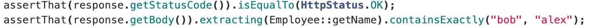
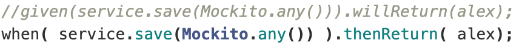

# LAB 4.1

## a) Identify a couple of examples on the use of AssertJ expressive methods chaining.

There are a lot of AssertJ examples throughout the code. For example:

- in **EmployeeRepositoryTest**:

- in **EmployeeRestControllerIT**:

## b) Identify an example in which you mock the behavior of the repository (and avoid involving a database).

- In **EmployeeController_WithMockServiceIT**:

## c) What is the difference between standard @Mock and @MockBean?

- @Mock is used when making unit tests in business logic (only using JUnit and Mockito). 

- @MockBean i used when  we write a test that is backed by a Spring Test Context and we want to add or replace a bean with a mocked version.

## d) What is the role of the file “application-integrationtest.properties”? In which conditions will it be used?

Used to keep N test properties in a single file. For example, is used to place the database settings so that the tests can be executed.

