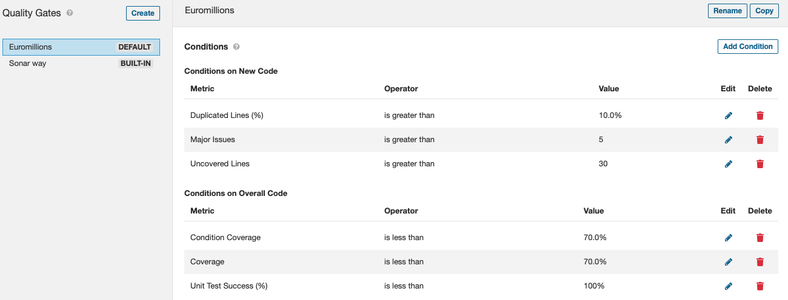

# LAb 6

## Task 1

### e/

According to the Sonar qube report, the code passed the quality gate test. 

Although it has passed, it has a bug in the code and a security hotspot. After analysing the details, it seems like there is a weak cryptography in a random generator. 

### f/

| **Issue**          | **Problem description**                        | **How to solve**                               |
|:------------------:|:----------------------------------------------:|:----------------------------------------------:|
| Bug                | "Random" objects should be reused              | Save and re-use the "Random"                   |
| Vulnerability      | Nothing found                                  | -                                              |
| Code smell (major) | "for" loop stop conditions should be invariant | Assign loop counter inside the "for" statement |
| Code smell (major) | Unused method parameters should be removed     | Remove unused parameter                        |
| Code smell (major) | Standard outputs should not be used directly to log anything | Replace System.out with a logger |

## Task 2

### a/

The total technical debt found was **2h10min**. This value means that it would take aproximatly 2h20min to refactor the code and solve this issues. The file that would take the most time to solve is in ***src/main/java/ui/DemoMain.java***, as it has 7 major code smells.

### d/

Using the same euromillions project (already had the jacoco plugin):

As we can see, there is a 71% code coverage, with 131 uncovered lines. Besides that, there are 12 conditions that need coverage, making a 76.9% condition coverage.

## Task 3

### a/

As I couldn't make the IES project run smoothly, I decided to use the euromilions. For the Quality gate, I decided to use this conditions:

**In the overall code:**

- Unit Test Success - I think that for a project to be successfull, all the unit tests need to pass, so 100%
- Coverage and Condition coverage - In my opinion, both of them need to be around 70% as the minimum.

**In the new code:**

- Uncovered Lines - Whenever making new code, this forces us to cover most of the lines written
- Major Issues - Avoid creating even more major issues with the new code
- Duplicated Lines - The new code must not have a lot of duplicated lines, so it isn't useless

### c/

For this I changed some tests to make sure that the coverage failed. Also tried to fail on the duplicated lines in the new code. As expected, both of them failed when running the analysis.

