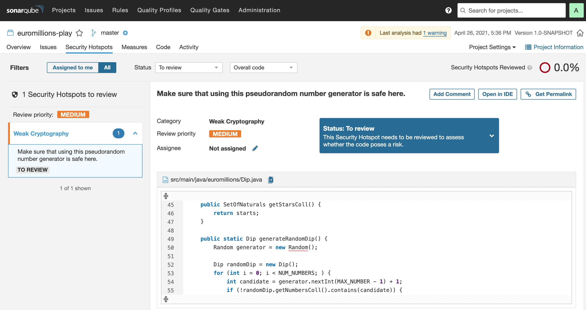

# LAb 6

## Task 1

### e/

According to the Sonar qube report, the code passed the quality gate test. 

Although it has passed, it has a bug in the code and a security hotspot. After analysing the details, it seems like there is a weak cryptography in a random generator. 

### f/

| **Issue**          | **Problem description**                        | **How to solve**                               |
|:------------------:|:----------------------------------------------:|:----------------------------------------------:|
| Bug                | "Random" objects should be reused              | Save and re-use the "Random"                   |
| Vulnerability      | Nothing found                                  | -                                              |
| Code smell (major) | "for" loop stop conditions should be invariant | Assign loop counter inside the "for" statement |
| Code smell (major) | Unused method parameters should be removed     | Remove unused parameter                        |
| Code smell (major) | Standard outputs should not be used directly to log anything | Replace System.out with a logger |

## Task 2

### a/

The total technical debt found was **2h10min**. This value means that it would take aproximatly 2h20min to refactor the code and solve this issues. The file that would take the most time to solve is in ***src/main/java/ui/DemoMain.java***, as it has 7 major code smells.

### c/

